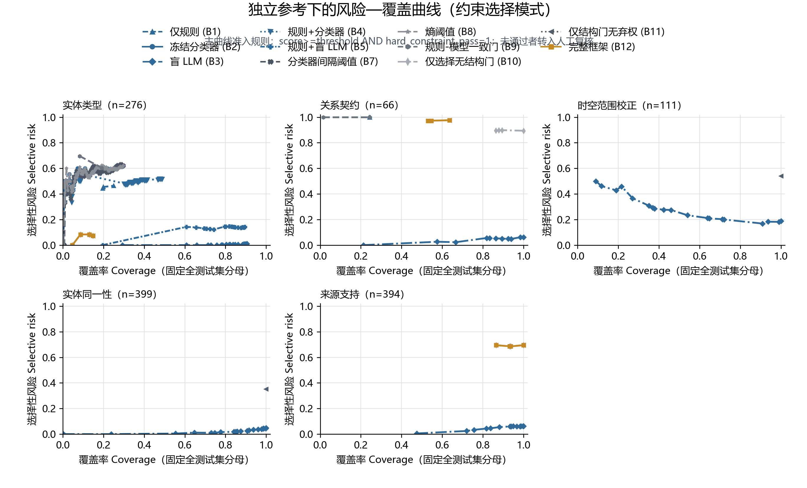
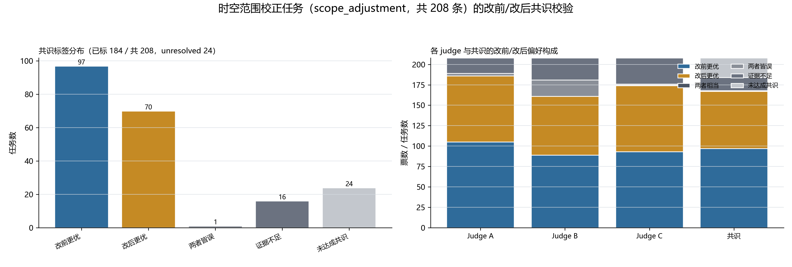
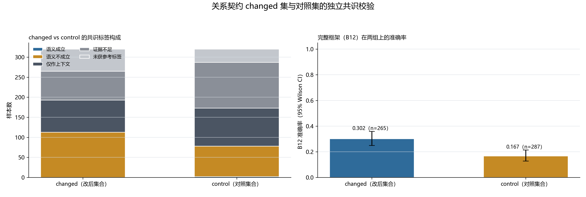
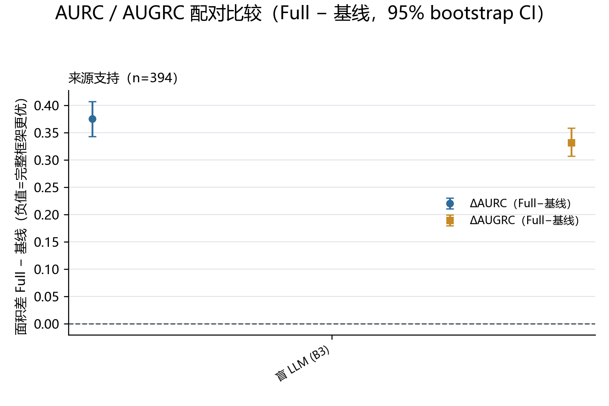

# 4 实验设计与结果分析（V3 重写稿）

> 本稿依据 GOAL.md §二十五（4.1–4.8 结构）、§二十六（修改原则）、§二十七（措辞边界）、§三十（图表清单）重写，全部数字与 V3 实验 CSV/JSON 同源，来源文件在各表图下方逐项标注。

---

## 【证据等级说明】（置于章首）

本章全部实验结果按下列六级标注证据等级（等级定义沿用项目审计约定；A/B/C 为运行方式，D 为解释资格，二者正交）：

- **A 级**（actual run）：真实新鲜运行；
- **B 级**（deterministic replay）：对冻结账本的确定性回放；
- **C 级**（cached model output）：缓存模型输出回放；
- **D 级**（shared-reference diagnostic）：与参考标注共享生产通道的诊断性结果，**不得解释为外部正确性**；
- **E 级**（independent evaluation）：与生产标签构造链解耦的独立评价；
- **F 级**（unavailable）：无法运行，明确记 NOT_AVAILABLE。

本章证据分布：

| 证据块 | 等级 | 说明 |
|---|---|---|
| IMCR 独立参考构建、盲评基线、选择性推断、统计检验（4.1–4.3、4.5–4.7） | **E** | 与 ERA 及生产信号解耦 |
| 全库结构消融（4.4、表D Panel A） | **B** | 确定性回放，结构合法性口径 |
| 效率计时（4.8） | **A**（cached 回放阶段为 C） | 计时类证据，不涉参考标签 |
| ERA 旧结果（0.7632/0.9914/0.0086 等） | **C+D** | 仅作"相对于 ERA 的一致性结果"保留（4.2 末、4.9） |

**术语与措辞边界（强制性）**：独立多模型共识参考（Independent Multi-model Consensus Reference，IMCR）是与生产标签链解耦的**外部 AI 参考标注**，不得称"人工金标准""ground truth""事实真值"；基于 IMCR 的指标一律解释为"与独立 AI 参考的一致性/支持度"，不得解释为"事实正确率"。本章区分五个概念：**事实真实性**（本章不主张）、**语义一致性**（与 IMCR 的标签一致）、**结构合法性**（硬约束违例计数）、**来源支持度**（证据文本对断言的支持水平）、**模型一致性**（judge 间可靠性）。旧稿数字凡在本章保留，均注明"相对于 ERA 的一致性结果"。

**可追溯性**：章内每个数字可通过"论文数字 → 表/图 → 汇总 CSV/JSON → raw JSONL → task_id → 样本文件 → 原始证据"逐级回查；各实验 manifest（`experiments/**/**.manifest.json`、`IMCR_CONSENSUS_MANIFEST.json`、`INDEPENDENT_BASELINE_MANIFEST.json`、`STATISTICAL_ANALYSIS_MANIFEST.json`）记录 seed=20260907、prompt SHA-256、模型 ID 与输出文件 SHA-256。除特别注明外，以下相对路径均以 `submission_work/final_submission_v3/` 为基准。

---

## 4.1 数据、任务与独立评价协议

### 4.1.1 语料、图谱与评价双轨

实验对象为长江流域 13 个省级行政区域的中共党史叙事文献语料及在其上构建的时空知识图谱 V2 发布库。发布库包含 152,979 个规范实体、424,150 条知识陈述（研究断言）和 466,312 条来源关联；断言按发布资格分层为 112,158 条严格语义层记录、268,047 条上下文记录和 43,945 条未决记录（占比 26.443%、63.196%、10.361%），严格语义层进一步派生 28,065 个事件框架与 11,532 个文化状态。上述规模数字为 A 级历史构建产物，可由发布数据库直接复核（库 SHA-256 见 `audit/BASELINE_FREEZE_MANIFEST.json`）。旧稿所称"983 册文献、302,230 页文本"等语料规模数字在 `audit/PAPER_CLAIM_EVIDENCE_MATRIX.csv` 中标记为 NOT_FULLY_VERIFIED，本稿不再将其作为实验输入规模引用。

评价协议采用**双轨制**：

1. **ERA 轨（历史对照）**：原 712 条集成参考标注（Integrated Reference Annotation，ERA）及其 159 条固定测试集/152 条核心样本继续保留，用于历史实验复现与方法演化追踪。由于 ERA 的产生与规则、source type、lexical hint、schema vote、历史 Qwen 输出等生产信号存在不同程度共享，该轨结果一律降格为 C+D 级"相对于 ERA 的一致性结果"，不再作为外部正确性依据（4.2 末给出逐位复现验证）。
2. **IMCR 轨（独立评价，本章主口径）**：新建独立多模型共识参考集，与生产标签构造链解耦，覆盖五类共 2,830 个评价任务。IMCR 样本采用分层加定向抽样：实体类型任务优先纳入高风险类型与规则—模型冲突样本；关系契约任务从全库消融中 w/o Relation Contract 相对 Full 发生变化的 3,412 条断言中抽取 320 条，并按谓词、主客体类型、阶段匹配 320 条对照；时空作用域任务对全部 208 条修正**全量**纳入（不抽样）；身份任务由 300 个真实合并候选对加 300 个真实难负例（同名异类型 60、同名人物 50、近名人物 50、事件—同名作品 40、机构—同名地名 60、别名碰撞 40）构成；来源支持任务按严格语义层/上下文/未决三层 400/300/300 分层抽取 1,000 条。IMCR 样本与 ERA 159 样本零交集（`experiments/08_independent_reference/SPLIT_LEAKAGE_AUDIT.json`）。

### 4.1.2 盲评协议

IMCR 的全部判断在字段级盲化约束下完成：judge 仅可见待判断对象、真实证据文本节选、局部关系上下文、冻结 schema 定义与任务说明（白名单机制）；ERA 标签、生产预测、risk_tier、semantic_status、auto_accepted、schema_votes、lexical_hint、缓存模型输出等生产信号经键级与字符串值级双重黑名单扫描，任何命中即中止构建（`code/independent_eval/blind_payload.py`，测试 `code/tests/test_no_production_label_leakage.py`）。208 条时空修正任务的闭包前/后两个状态经确定性随机化为匿名位 a/b，judge 不知道哪个来自最终系统，共识聚合后再按独立映射文件解码（`experiments/08_independent_reference/payloads/SCOPE_ADJUSTMENT_PAYLOAD_AB_MAPPING.csv`）。

judge 面板由来自三个模型家族的模型构成：Judge A（Qwen 家族 Qwen3.6-35B-A3B）、Judge B（GPT 家族 gpt-5.6-luna）、Judge C（MiniMax 家族 minimax-m3:free），满足"至少 3 个 judge、至少 2 个家族、生产用过的 Qwen 不作为唯一 judge"的约束。三个 judge 相互隔离、独立作答，第一层标签不使用任何模型间辩论；每次调用 temperature=0、top_p=1，输出强制为含 task_id/decision/confidence/evidence/reason_code/explanation/insufficient_evidence 七字段的 JSON，非法输出经有界重试（3 次）后标记 MODEL_OUTPUT_INVALID 落盘，不人工修改。全部 11 项调用日志字段（model_id、provider、prompt_version、temperature、top_p、seed、timestamp、raw_response、parsed_response、retry_count、validation_error）逐条存档于 `experiments/08_independent_reference/raw_runs/`。对 2,830 个任务共执行 3 个 judge 的独立评审与 1 组盲 LLM 基线（B3，4.2 节）调用，合计 11,320 次模型调用（不含重试）。

### 4.1.3 共识规则、参考集与 judge 一致性

共识规则采用三 judge 档：3/3 一致记 strong_consensus，2/3 一致记 weak_consensus，其余为 unresolved，不以多数票强造伪参考。全程 2,830 个任务形成 strong 参考 1,246 条、strong+weak 可用参考（labeled）2,593 条、unresolved 237 条。主评价（primary）使用 strong 参考集 `IMCR_REFERENCE_STRONG.csv`，次级评价使用 strong+weak 集合 `IMCR_REFERENCE_ALL.csv`。为控制"预测模型与参考共享同一模型"的污染，管线为面板内每个 judge 对称生成 leave-one-out 参考集：`IMCR_REFERENCE_LEAVE_A_OUT.csv`（1,621 条，即 leave-Qwen-out）、`IMCR_REFERENCE_LEAVE_B_OUT.csv`（1,640 条）、`IMCR_REFERENCE_LEAVE_C_OUT.csv`（1,824 条）。B3 盲 LLM 基线（gpt-5.6-luna）与 Judge B 为同一模型实例，故其主对照参考为 leave-B-out 集（4.2 节）。

表A 给出五类任务的 judge 可靠性。实体类型任务一致性很高（Fleiss κ=0.780，平均两两一致率 0.801）；时空作用域（κ=0.449）、身份判定（κ=0.431）与来源支持（κ=0.421）为中等；**关系契约任务的一致性接近随机水平（Fleiss κ=0.037，平均两两一致率 0.356）**，其 strong 参考仅 66/640 条。逐 judge 剔除（leave-one-judge-out）的标签稳定率在实体任务不低于 0.817，在关系契约任务降至 0.361–0.449。judge 间可靠性的巨大任务间差异本身构成一项诚实发现：**独立 AI 共识在细粒度关系语义判定上尚不具备可用的参考资格**，这直接约束 4.5 节关系契约结论的强度。

**表A 独立 judge 一致性统计（3 judge，n 为任务数）**

| 任务 | n | strong | weak | unresolved | 平均两两一致率 | Fleiss κ | Krippendorff α | LOJO 稳定率（最小/均值） |
|---|---|---|---|---|---|---|---|---|
| entity_type | 382 | 276 | 90 | 16 | 0.801 | 0.780 | 0.781 | 0.817 / 0.836 |
| scope_adjustment | 208 | 111 | 73 | 24 | 0.651 | 0.449 | 0.450 | 0.668 / 0.736 |
| identity_pair | 600 | 399 | 187 | 14 | 0.769 | 0.431 | 0.431 | 0.766 / 0.787 |
| provenance_support | 1000 | 394 | 511 | 95 | 0.578 | 0.421 | 0.419 | 0.543 / 0.624 |
| relation_contract | 640 | 66 | 486 | 88 | 0.356 | 0.037 | 0.037 | 0.361 / 0.413 |
| 全部（五任务非加权均值） | 2830 | 1246 | 1347 | 237 | 0.631 | 0.424 | 0.424 | 0.631 / 0.679 |

数据来源：`experiments/08_independent_reference/JUDGE_RELIABILITY_SUMMARY.csv`、`JUDGE_PAIRWISE_AGREEMENT.csv`、`LEAVE_ONE_JUDGE_OUT.csv`、`IMCR_CONSENSUS_MANIFEST.json`。

### 4.1.4 评价指标与统计口径

选择性预测沿用 V2 的既有数学定义，不重新定义口径。固定全测试集分母下报告：覆盖率（coverage）、已接纳预测与参考的一致率（selective accuracy；**注意这是与独立 AI 参考的一致性，不是事实正确率**）、选择性风险（selective risk）、广义风险（generalized risk）、安全覆盖率（safe coverage，参考一致且通过任务级硬约束）、错误暴露率（error exposure）、"已接纳样本 Macro-F1"与"全分母 Macro-F1"（两者严格分列，不再合并表述）、风险—覆盖曲线下面积 AURC 及归一化值、AUGRC 及归一化值。比例类指标给 Wilson 95% CI；曲线面积给 2,000 次固定种子 percentile bootstrap 95% CI（每次 replicate 全部落盘）；配对方法比较优先使用共享重采样索引的配对 bootstrap（ΔAURC/ΔAUGRC，Full−基线，负值=Full 更优）；二值配对结果适用时用 McNemar 精确检验。类别极不均衡任务同时报告 macro-F1。面积指标仅在满足 area gate（数值置信可得、分数覆盖完整、离散点充足）的配对上计算，不满足者明确记 not_applicable，不强行报告。

---

## 4.2 选择性预测的独立基线比较

### 4.2.1 基线设置

按 GOAL Phase 6 设置 B1–B12 共 12 条基线，统一在 IMCR 参考集上以 fresh 运行评价，禁止缓存结果冒充新 run；无法运行的组合在方法×任务网格中显式落盘 NOT_AVAILABLE（网格完整性审计 PASS，`experiments/09_independent_baselines/INDEPENDENT_BASELINE_AUDIT.json`）。B1 Rule-only（规则引擎/契约表）；B2 冻结本地分类器（TF-IDF+逻辑回归，分数表冻结）；B3 盲 LLM（gpt-5.6-luna，对冻结盲评 payload 的 2,830 次 fresh 调用，temperature=0，与 judge 共享 payload 与 prompt，仅模型不同）；B4 规则+分类器；B5 规则+盲 LLM；B6 分类器置信阈值（与 B2 置信扫描同曲线，不另发重复行）；B7 分类器 margin 阈值；B8 归一化熵阈值；B9 规则—模型一致性门；B10 选择性预测、无结构门禁；B11 结构门禁、无弃权；B12 完整框架（生产发布状态映射：实体类型=发布类型，关系=发布层→参考标签空间映射，scope=改后状态恒定主张，身份=规范共属查询，来源支持=发布层→支持等级映射；生产端不预测 invalid/unsupported/contradicted，该披露随结果一并报告）。B1–B12 的预测一旦由设计文件固定，未因结果不利而回改。

### 4.2.2 主要结果

表B 给出主口径（IMCR strong 参考）下的独立基线比较；图A 给出约束选择风险—覆盖曲线。核心事实如下：

**表B 独立基线比较（IMCR strong 参考；覆盖率为固定全测试集分母；括号内为 Wilson 95% CI）**

Panel 1：entity_type（n=276，唯一具备完整方法网格的任务）

| 方法 | 覆盖率 | 选择一致率 | AURC |
|---|---|---|---|
| B1 Rule-only | 0.250 (0.203–0.304) | 0.536 (0.420–0.649) | 0.068 |
| B2 冻结分类器 | 0.297 (0.246–0.354) | 0.378 (0.281–0.486) | 0.164 |
| B4 规则+分类器 | 0.489 (0.431–0.548) | 0.482 (0.399–0.565) | 0.243 |
| B7 margin 阈值 | 0.297 (0.246–0.354) | 0.378 (0.281–0.486) | 0.161 |
| B8 熵阈值 | 0.297 (0.246–0.354) | 0.378 (0.281–0.486) | 0.165 |
| B9 规则—模型一致门 | 0.192 (0.150–0.243) | 0.396 (0.276–0.531) | 0.100 |
| B5 规则+盲 LLM | 0.895 (0.853–0.926) | 0.858 (0.809–0.896) | 0.069 |
| B3 盲 LLM | 0.906 (0.866–0.935) | 0.988 (0.965–0.996) | 0.001 |
| B12 完整框架 | 0.149 (0.111–0.195) | 0.927 (0.806–0.975) | 0.007 |

Panel 2：B1/B3/B12 五任务全貌（n：entity 276、relation 66、scope 111、identity 399、provenance 394）

| 方法 | entity 一致率 | relation 一致率 | scope 一致率 | identity 一致率 | provenance 一致率 |
|---|---|---|---|---|---|
| B1 Rule-only | 0.536 (69/276) | 0.000 (0/16) | —（不可用） | —（不可用） | —（不可用） |
| B3 盲 LLM | 0.988 (0.965–0.996) | 0.939 (0.854–0.976) | 0.811 (0.728–0.873) | 0.952 (0.927–0.969) | 0.937 (0.908–0.957) |
| B12 完整框架 | 0.927 (41/276) | 0.024 (1/42) | 0.459 (0.370–0.552) | 0.647 (0.599–0.692) | 0.305 (0.261–0.352) |

数据来源：`experiments/13_selective_inference_independent/imcr_strong/imcr_strong_SELECTIVE_GOAL13_METRICS.csv`、`experiments/14_statistical_tests/WILSON_CI_TABLE.csv`。

**图A** 数据来源：`figures/imcr_risk_coverage.png`（数据 `experiments/13_selective_inference_independent/imcr_strong/imcr_strong_RISK_COVERAGE_POINTS.csv`；审计 `figures/imcr_risk_coverage_AUDIT.json`）。图中 B3 盲 LLM 曲线位于其他全部方法之下（风险更低），本文不为图面效果隐藏该失败曲线。

**有利结果（完整框架 vs 规则与分类器通道）**：完整框架在实体类型任务上与规则通道高度互补——McNemar 配对检验 Full vs B1 为 90:0（Full 胜，精确 p≈1.6×10⁻²⁷），vs 规则+分类器 B4 为 61:45（p=0.145，差异不显著），vs 熵阈值 B8 为 93:48（Full 胜，p≈1.9×10⁻⁴）。完整框架以 0.149 的低覆盖率取得 0.927 的已接纳一致率，选择一致率显著高于全部规则/分类器基线；在身份任务上 Full vs B1 为 258:0（B1 无预测组件），在 provenance 任务上 Full vs B1 为 120:0。这一梯度表明：由规则与冻结分类器构成的生产接受边界，确实能把已接纳集合的独立一致率提高到显著高于任一单通道基线的水平——**选择性预测机制在"降低已接纳集合的选择性风险"意义上得到独立参考支持**。

**不利结果（盲 LLM 显著优于完整框架，必须如实呈现）**：B3 盲 LLM 在全部五类任务上的一致率均高于 B12 完整框架，且 McNemar 全部显著有利于 B3：entity 2:141（p≈1.8×10⁻³⁹）、relation 1:56（p≈8.0×10⁻¹⁶）、scope 7:46（p≈4.0×10⁻⁸）、identity 10:132（p≈2.6×10⁻²⁸）、provenance 8:257（p≈1.9×10⁻⁶⁵）。配对 bootstrap 面积比较中唯一满足 area gate 的 provenance 任务上，ΔAURC(Full−B3)=+0.375（95% CI [0.343, 0.407]）、ΔAUGRC=+0.332（[0.307, 0.358]），均为正值，即**完整框架的风险—覆盖面积劣于盲 LLM**（图B）。图A 中 B3 曲线位于全部其他方法之下（风险更低），本文不为图面效果隐藏该曲线。

**对不利结果的解释与定位**：其一，B12 的预测是生产发布层状态的映射（如关系任务把发布层映射为 valid/context_only/insufficient_evidence，恒不预测 invalid；来源任务把发布层映射为支持等级，恒不预测 unsupported/contradicted），生产标签由规则、冻结分类器与历史模型输出按结构准入规则构建，其目标函数是发布安全与结构合法，而非语义判定本身；独立强模型在纯语义判定上与参考的一致性更高，是预期内的通道差异。其二，该结果**不否定选择性预测机制**：机制的价值主张是"以显式接受边界与结构门控控制错误暴露、保证发布层结构合法"，表B 显示机制在 B1/B2 一侧的增益仍然成立；但该结果**否定了旧稿隐含的"框架标签质量优于强 LLM"的主张**——在独立参考下这一主张不成立，4.9 节据此改写摘要与结论。

**方法论警示：同模型自证膨胀的实证**。B3 与 Judge B 为同一模型（gpt-5.6-luna）。对包含 Judge B 票的主参考，B3 五任务一致率为 0.988/0.939/0.811/0.952/0.937；改用 leave-B-out 参考（剔除 Judge B 票后重聚合）后降至 0.923/0.286/0.699/0.866/0.798，五任务全部下降，关系任务降幅达 0.653。这一实证表明：**当同一模型既产生预测又参与参考投票时，一致率被系统性抬高**，且在低一致性任务上抬高幅度可达数倍。旧稿头条数字 0.9914 恰为"缓存 Qwen 输出与包含同一 Qwen 通道的 ERA"之间的一致率（C+D 级），属于同类自指结构的产物。本文据此把 0.7632/0.9914/0.0086 一组数字明确定位为**相对于 ERA 的一致性结果**：v3 确定性复现验证（`experiments/13_selective_inference_independent/era_replay/ERA_REPLAY_PARITY_REPORT.json`，verdict=PASS，容差 10⁻⁹，逐曲线零差异）确认这三个数字可逐位复现为 M4（规则+缓存 LLM 一致性选择）在 152 条核心集上的 coverage/accuracy_on_covered/selective_risk（0.763158/0.991379/0.008621），但其证据资格仅为共享通道诊断，不构成外部历史事实正确率。

---

## 4.3 选择机制消融

B10（去除结构门禁的选择性预测）、B11（保留结构门禁、去除置信弃权）与 B12（完整框架）共用同一预测列，仅接受规则不同（`audit/04_BASELINE_DESIGN.md` §7），构成对"类别门禁—信号一致性—弃权—结构门"四个选择机制的受控消融。表C 给出主口径结果。

**表C 选择机制消融（IMCR strong 参考）**

| 任务 | 方法 | 覆盖率 | 选择一致率 | AURC | AUGRC |
|---|---|---|---|---|---|
| entity_type (n=276) | B10 | 0.149 | 0.927 | 0.0067 | 0.0007 |
| | B11 | 0.149 | 0.927 | 0.0054 | 0.0008 |
| | B12 | 0.149 | 0.927 | 0.0067 | 0.0007 |
| relation_contract (n=66) | B10 | 1.000 | 0.106 | 0.5086 | 0.4475 |
| | B11 | 0.636 | 0.024 | 0.3106 | 0.1977 |
| | B12 | 0.636 | 0.024 | 0.3609 | 0.1969 |
| scope_adjustment (n=111) | B10/B11/B12 | 1.000 | 0.459 | 0.2703（单点） | 0.2703 |
| identity_pair (n=399) | B10/B11/B12 | 1.000 | 0.647 | 0.1767（单点） | 0.1767 |
| provenance_support (n=394) | B10 | 1.000 | 0.305 | 0.3936 | 0.3469 |
| | B11 | 1.000 | 0.305 | 0.3477 | 0.3477 |
| | B12 | 1.000 | 0.305 | 0.3936 | 0.3469 |

数据来源：`experiments/13_selective_inference_independent/imcr_strong/imcr_strong_SELECTIVE_GOAL13_METRICS.csv`；置信区间同 `WILSON_CI_TABLE.csv`。

三点结论。**第一，结构门禁是选择机制中实际改变接受域的组件**：关系任务上 B10 全接纳（覆盖率 1.000），加入契约类型兼容门后 B11/B12 把覆盖率压到 0.636，即 36.4% 的候选被结构门移出自动接受域（对应全库口径的 3,412 条路由变化，见 4.4/4.5 节）；实体任务上类别硬约束门与结构门不改变操作点（三变体同为 0.149）。**第二，弃权机制的作用边界清晰**：scope/identity 为点指标任务（生产端无逐对置信，不虚构代理分数，仅报单点），弃权仅在具备数值置信的任务上定义。**第三，一项必须如实报告的负结果**：在全部三个具备曲线的任务上，使用生产置信度排序的 B12/B10 曲线面积均不优于常数置信的 B11（entity 0.0067 vs 0.0054；provenance 0.3936 vs 0.3477；relation 0.3609 vs 0.3106）。即在独立参考下，**生产置信信号对风险排序不具备正向选择力**；完整框架的选择能力主要来自硬约束门与规则—模型通道结构，而非连续置信分数的排序质量。这与 4.2 节"机制有效、标签质量不占优"的定位互相印证。

---

## 4.4 结构准入的全库约束效应

本节保留 V2 全库确定性结构消融（B 级证据），口径为 Panel A（全库确定性结构审计），所有数字解释为"相对于冻结发布库的结构一致性结果"，不涉及语义正确性。

**表D Panel A 全库结构准入确定性消融（424,150 条断言，B 级确定性回放）**

| 消融配置 | 关键结构指标 |
|---|---|
| 完整框架（发布态） | 严格语义层 112,158 条；已定义关系契约违例 0；时间/空间强角色非法归属 0 |
| w/o Risk Routing | 43,945 条发布状态改变（路由分布：deterministic_rule 295,097 / local_classifier_or_rule 85,107 / model_or_manual_review 43,886 / manual_review 60） |
| w/o Identity Projection | 24,005 条状态改变；身份回放：154,150 个源实体收敛至 152,979 个规范实体，减少 1,171 |
| w/o Relation Contract | 严格层新增 3,412 条主体—客体类型违例 |
| w/o Role-owner Closure | 44 条时间强角色非法归属 + 112 条空间强角色非法归属；相对发布态 208 条断言状态改变 |
| w/o Global Closure | 27,475 条状态改变（捆绑移除，**不等于**各组件效应之和，禁止相加解释） |
| w/o Provenance Gate | 0 条改变（发布库中全部严格层断言均已带谱系，见 4.7 节重新定位） |

数据来源：`submission_work/final_submission_v2/experiments/05_ablation/ablation_experiment_summary.json`（对应旧稿表3、图4；文件未覆盖，原样保留）；V3 结构提取 `experiments/10_structural_validation/STRUCTURAL_REPLAY_AUDIT.json`。

该 Panel 支持的结论仅限**结构合法性**：移除任一结构准入组件都会使已定义的硬约束违例重新出现（3,412 / 44+112 / 24,005 / 27,475），而发布态在全库范围保持已定义违例为零。这些数字不能被解释为语义收益；208 条时空修正与 3,412 条关系路由变化是否同时在语义上合理，交由 4.5 节的独立语义验证（Panel B）回答。

---

## 4.5 结构修正的独立语义验证

本节为 Panel B（独立 AI 语义验证，E 级证据），对象为 4.4 节的两类最大结构修正：208 条时空作用域调整与 3,412 条关系契约路由变化。

### 4.5.1 208 条时空作用域调整的盲评

全部 208 条修正以"闭包前/闭包后"双状态盲评：状态匿名化为 a/b、顺序随机化，judge 仅依据断言文本、证据节选与 schema 角色定义判断哪个状态更符合证据。共识结果（图C）：

- **strong 参考（n=111，3/3 一致）**：改后更优 51 条（45.9%），**改前更优 58 条（52.3%）**，证据不足 2 条；改后方向未获过半支持，且改前略占多数（差约 6.3 个百分点）。
- strong+weak 参考（n=184）：改前 97、改后 70、两者皆误 1、证据不足 16，方向与 strong 一致。
- 单个 judge 的解码后偏好同样以改前略多（Judge A：改前 105 vs 改后 81；Judge B：89 vs 72），说明该方向性并非共识聚合的伪象。
- 对应地，以"改后更优"为正确口径的二值化下，B12 在 strong 参考的选择一致率为 0.459（Wilson 95% CI [0.370, 0.552]）。

**图C** 数据来源：`figures/imcr_scope_validation.png`（审计 `figures/imcr_scope_validation_AUDIT.json`；参考 `experiments/08_independent_reference/IMCR_REFERENCE_ALL.csv` + `IMCR_CONSENSUS_MANIFEST.json`；A/B 解码映射 `payloads/SCOPE_ADJUSTMENT_PAYLOAD_AB_MAPPING.csv`）。

**诚实结论（对旧稿判断的修改）**：独立语义验证**未能确认** 208 条时空修正的方向优势，strong 共识下改前偏好甚至以约 6.3 个百分点占优。结合两点限定：其一，judge 间一致性仅为中等（κ=0.449），其二，发布库仅保存谱系指针、原始证据文本未内置，judge 常只能依据元数据与局部上下文判断（证据不足标签部分由证据缺失驱动），本文将本组件的主张收缩为：**role-owner 闭包消除 44+112 条已定义非法归属的结构收益成立（B 级确定性证据）；其语义合理性改善未获独立参考确认，方向存在争议**。旧稿中"该表示能够直接改变知识的实际发布结果"的表述保留（208 条确已改变发布状态），但任何"提高时空语义归属合理性"的表述在本数据上不予保留。后续工作须先补齐证据原文的机器可读回传，再复核该方向性结论。

### 4.5.2 3,412 条关系契约路由变化的评价与参考失效

从 3,412 条 changed 断言中分层抽取 320 条，并按谓词、主客体类型、阶段匹配 320 条对照，构成 640 条关系契约评价任务（`experiments/10_structural_validation/RELATION_CONTRACT_CHANGED_SET.csv`）。如 4.1.3 节所述，**该任务的独立参考本身失效**：Fleiss κ=0.037、平均两两一致率 0.356、strong 参考仅 66/640（10.3%）、leave-one-judge-out 稳定率最低 0.361。在该受限参考上（图D）：

- strong+weak 口径下 changed 组有标签 265 条：语义不成立 113、仅作上下文 80、证据不足 72、语义成立 0；对照组 287 条：不成立 76、仅作上下文 95、证据不足 114、成立 2。changed 组被判"不成立"的比例（42.6%）高于对照组（26.5%），方向上与"契约把这些断言移出严格层"的意图一致。
- 图D 给出 B12 在两组上的一致率：changed 0.302（80/265，Wilson CI [0.250, 0.360]）高于 control 0.167（48/287，[0.129, 0.215]）。
- 但在 strong 口径下两组"语义成立"标签均为 0，B12 整体选择一致率仅 0.024（1/42）。

**图D** 数据来源：`figures/imcr_relation_contract_validation.png`（审计 `figures/imcr_relation_contract_validation_AUDIT.json`；样本 `experiments/08_independent_reference/RELATION_CONTRACT_SAMPLE.csv`）。

**诚实结论（对旧稿判断的修改）**：旧稿以 148 条"契约阳性构造"的参考子集证明关系契约有效，V2 审计已确认该子集饱和（148/148，无辨别力），不能作为证据。本轮新参考具备抽样辨别力设计，但 judge 一致性（κ=0.037）未达到可用参考的资格线，**因此 3,412 条路由变化的语义收益在本轮评价中既不能确认、也不能证伪**。本文能主张的仅是：契约路由的结构效应（3,412 条移出严格层，B 级）成立；changed 组在方向上一致地比对照组呈现更多"语义不成立"判定，可作为后续研究的提示性证据（弱证据，且受参考失效约束）。关系契约语义层面的结论强度由"有效"降级为"结构效应确定、语义效应未定"。

---

## 4.6 身份投影与实体规范化验证

身份投影在全库收敛 1,171 次身份归并（154,150→152,979）。为检验这些归并是减少重复还是误合并，构造 600 对评价任务：300 个真实合并候选对（positive merge candidate）与 300 个真实难负例（hard negative，六类同名/近名构造，见 4.1.1），judge 仅见名称、别名、各自独立关系上下文、时空信息与证据，不见 canonical id 与归并结果。

共识结果（strong 参考 n=399）：判同实体 356、判异实体 41、证据不足 2。B12（发布归并状态查询：同规范实体→same_entity，否则 different_entity）在 strong 参考的选择一致率为 0.647（Wilson 95% CI [0.599, 0.692]）。分解后（表E）：

**表E 身份投影验证（IMCR strong 参考，n=399）**

| 指标 | 数值 |
|---|---|
| 300 个已执行合并的 strong 子集 | 218 对进入 strong 参考，其中 217 对共识判同实体（**99.5%**），1 对证据不足 |
| 系统判定与共识的总一致率 | 0.647 (0.599–0.692)；正确 258 = 合并候选判同 217 + 硬负例判异 41 |
| 硬负例上的分歧 | 强共识下 180 个可判定负例中 139 个被判"同实体"（77.2%），与系统的"异实体"判定冲突 |
| 分歧的类别构成（strong） | 机构—同名地名 40/40 判同；同名异类型 40/40 判同；事件—同名作品 29/30 判同；别名碰撞 22/27 判同；同名人物 8/9 判异；近名人物 34/34 判异 |
| McNemar（配对） | Full vs B1 = 258:0（B1 无预测组件）；Full vs B3 = 10:132（B3 优，p≈2.6×10⁻²⁸） |

数据来源：`experiments/11_identity_validation/IDENTITY_PAIR_TASKS.jsonl`、`IDENTITY_PAIR_METADATA.csv`；正确性重算见 `experiments/09_independent_baselines/IMCR_BASELINE_RUNS.csv` 与 `WILSON_CI_TABLE.csv`。

**诚实解释**：其一，**已执行的 300 项归并在独立共识下获得 99.5% 确认**，"身份投影没有把不同实体误合并"在该意义上得到独立参考支持——这支持"降低身份误合并风险"的表述。其二，0.647 的总一致率**不能**解释为系统存在约 35% 的身份错误：全部分歧集中于系统保持分离的同名难负例（强共识下 180 个可判定负例中 139 个被共识判同），其中机构—地名、事件—作品、同名异类型等**类型不相容对也被共识整体判同**（如 org_vs_place 40/40）。类型不相容的两者不可能是同一实体，故分歧方向更可能反映**共识参考按名称相似过度合并的系统性倾向**，而非系统漏并。由于 κ=0.431 仅为中等，本文不作任一方向的强主张：已执行合并的高确认率成立；"未合并同名对不存在漏并"不成立为已验证结论，须留待带类型约束的人工复核。其三，B3 盲 LLM 一致率 0.952（leave-B-out 口径 0.866）高于 Full（0.647），同为 4.2 节"标签质量不优于强 LLM"判断在身份任务上的体现。

---

## 4.7 来源可追溯性与证据支持

### 4.7.1 三层断言的来源支持质量

对 1,000 条按发布层分层的断言（严格语义层 400、上下文 300、未决 300），judge 依据 `research_assertion_provenance` 回溯的真实来源文本判断支持水平（fully_supported/partially_supported/unsupported/contradicted/insufficient_evidence）。strong 参考覆盖 394 条，整体构成：完全支持 134（34.0%）、部分支持 96（24.4%）、不支持 152（38.6%）、矛盾 2（0.5%）、证据不足 10（2.5%）；完全+部分支持合计 58.4%。分层结果（表F）：

**表F 来源支持质量分层（IMCR strong 参考）**

| 发布层 | n | 完全支持 | 部分支持 | 不支持 | 矛盾 | 证据不足 | 完全+部分支持率 |
|---|---|---|---|---|---|---|---|
| strict_semantic | 178 | 78 (43.8%) | 37 (20.8%) | 58 (32.6%) | 2 (1.1%) | 3 (1.7%) | **64.6%** |
| contextual | 117 | 29 (24.8%) | 38 (32.5%) | 47 (40.2%) | 0 | 3 (2.6%) | 57.3% |
| unresolved | 99 | 27 (27.3%) | 21 (21.2%) | 47 (47.5%) | 0 | 4 (4.0%) | 48.5% |
| 合计 | 394 | 134 | 96 | 152 | 2 | 10 | 58.4% |

数据来源：由 `experiments/08_independent_reference/IMCR_REFERENCE_STRONG.csv` 与 `experiments/12_provenance_validation/PROVENANCE_SUPPORT_METADATA.csv` 按 sample_id 连接统计；抽样设计 `PROVENANCE_SUPPORT_SAMPLE.manifest.json`。

两点结论。**其一，支持率的层间梯度成立**：strict > contextual > unresolved 在 strong 口径下单调（64.6% > 57.3% > 48.5%），即严格语义层的准入确实伴随更高的独立证据支持水平，"提高来源支持率"的表述在层间比较意义上成立；但在 strong+weak 口径下梯度收窄（67.0%/65.8%/63.2%），解释时应以 strong 口径为主并披露弱化。**其二，一项不利事实必须如实报告**：严格层内仍有 33.7%（60/178，含 2 条矛盾判定）被独立参考判为不支持或矛盾。严格层是"更高质量"而非"无风险"的层，旧稿任何暗示严格层断言均获证据支持的说法据此修正。

### 4.7.2 Provenance Gate 的定位与故障注入压力测试

全库消融中 w/o Provenance Gate 变化数为 0，其正确解释是：当前发布库的全部 424,150 条断言均已带谱系（门为发布后饱和），**该结果既不能证明门无效，也不能作为性能优势报告**。本文将其定位为**发布安全不变量**（release safety invariant）：任何进入严格语义层的断言必须携带至少一条来源关联（gate 条件 n_provenance_rows>0），其作用对象是"未来进入系统的断言流"。

为检验不变量在真实故障下的行为，增设一个明确标注为**合成故障注入压力测试（synthetic failure-injection stress test / negative-control）**的实验：在内存中按 1%/5%/20% 三档比例（派生种子记录于 manifest）程序化删除严格层断言的谱系引用（数据库全程只读），回放门控行为。结果：三档分别注入 1,122/5,608/22,432 条故障断言，**全部被拦截并降级至上下文层（拦截率 100%），对照组 0 假阳性**（`experiments/12_provenance_validation/PROVENANCE_GATE_STRESS_SUMMARY.json`；B 级确定性回放，与真实语料实验严格区分，不构成真实数据上的性能声明）。

### 4.7.3 与选择机制的联合评价

在来源支持任务上，B12（发布层→支持等级映射）的强共识一致率为 0.305（覆盖率 1.0），B3 盲 LLM 为 0.937（leave-B-out 口径 0.798）；二者为全实验中唯一满足 area gate 的配对：ΔAURC(Full−B3)=+0.375 [0.343, 0.407]，ΔAUGRC=+0.332 [0.307, 0.358]，均为 Full 劣势（图B）。McNemar Full vs B3 = 8:257（p≈1.9×10⁻⁶⁵）。因此在该任务上，本文不主张框架的选择排序优于盲 LLM；框架的贡献边界是"每条已发布断言可回溯真实来源文本"（466,312 条来源关联，A 级构建产物）与层间支持率梯度，而非逐条支持判定的排序质量。

**图B** 数据来源：`figures/imcr_aurc_augrc_ci.png`（审计 `figures/imcr_aurc_augrc_ci_AUDIT.json`；`experiments/14_statistical_tests/PAIRED_BOOTSTRAP_DELTAS.csv`，2,000 次共享重采样索引配对 bootstrap；面积交叉核验 `imcr_strong_RISK_COVERAGE_SUMMARY.csv`，最大差 0）。**如实说明**：12 条基线×5 任务的配对中仅 provenance×B3 满足 area gate，其余配对因无数值置信/分数覆盖不完整/离散点不足记 not_applicable，不入图。

---

## 4.8 效率与规模扩展

保留 V2 端到端效率实验：五档规模（10%/25%/50%/75%/100%，对应 42,415–424,150 条断言）× 每档 5 次重复的本地确定性构建链计时。证据等级：各实际执行阶段为 A 级计时证据，cached 模型回放阶段为 C 级；计时类指标不涉参考标签，**不受 ERA 自指问题影响**，可直接沿用。结果（中位数）：总冷启动时间 17.19s（10%）→ 46.75s（100%），吞吐 2,467 → 9,073 断言/s（超线性收益，规模越大单断言成本越低），峰值内存 430 → 1,429 MB。数据来源：`submission_work/final_submission_v2/experiments/07_efficiency/END_TO_END_SUMMARY.csv`（对应旧稿表4、图8，原文件未覆盖）；拟合 `SCALING_FITS.csv`。

作为独立评价链的成本披露：IMCR 构建与盲评基线合计 11,320 次模型调用（3 judge × 2,830 + B3 2,830，不含无效输出重试），全部调用日志、prompt 版本（imcr.v3.1）与 payload SHA-256 存档，可复现（`experiments/08_independent_reference/raw_runs/`、`payloads/PAYLOAD_BUILD_MANIFEST.json`）。

---

## 4.9 本章发现对摘要与结论的约束（替换建议）

按 GOAL §二十六，以下给出旧稿三数字与相关结论的改写方案。

**（1）旧头条数字（0.7632/0.9914/0.0086）**：保留于"历史对照"位置，必须写成"相对于 ERA 的一致性结果"。建议表述："在作为历史对照的 ERA 集成参考标注上，规则—缓存 LLM 一致性选择覆盖 116/152 条，其中 115 条与 ERA 一致（覆盖率 0.7632、接受样本一致率 0.9914、选择性风险 0.0086，均为相对于 ERA 的一致性结果，确定性复现通过）；该参考与生产信号共享通道，不构成外部正确性证据。"

**（2）摘要 [结果] 段替换建议**：

> 在与生产标签链解耦的 2,830 条独立多模型共识参考（IMCR）上重新评价：三 judge 面板在实体类型任务上可靠性高（Fleiss κ=0.78），关系语义任务上接近随机（κ=0.037），后者限定了关系层结论强度。盲评 LLM 基线在全部五类任务上一致率高于完整框架（如实体类型 0.988 对 0.927，McNemar p<10⁻³⁸），表明框架的生产标签质量不优于强 LLM；选择性预测机制的价值在于以显式接受边界与结构门控控制错误暴露与结构违例：完整框架对规则通道的配对增益显著（实体任务 90:0），结构门禁将 36.4% 的关系候选移出自动接受域，全库 112,158 条严格语义层记录的已定义结构违例为 0。300 项已执行实体合并中 99.5% 获独立共识确认；严格语义层的来源支持率呈 strict（64.6%）> contextual（57.3%）> unresolved（48.5%）的层间梯度。208 条时空修正的结构收益成立，但其语义方向未获独立参考确认；Provenance Gate 定位为发布安全不变量（故障注入下拦截率 100%、零假阳性）。

**（3）结论（1）条替换建议**：删除"规则—Qwen 一致性选择……接受样本一致率达到 0.9914，选择性风险控制为 0.0086"作为核心贡献的表述，改为："选择性预测形成了以显式接受边界控制错误暴露的机制：在独立参考下，框架已接纳集合对规则通道的配对优势显著，但对强 LLM 基线不占优；框架的定位因此是发布安全的结构化控制层，而非语义判定层。"

**（4）必须删除或降级的旧表述**：①任何"高准确率/事实正确"含义的表述；②"结构准入后预定义关系契约和强时空归属约束均得到满足"保留结构合法性含义、删除语义暗示；③"208 条作用域调整表明该表示能直接改变发布结果"可保留（发布状态事实），但其语义合理性主张降级为"未获独立确认"；④以 148 条饱和子集支持关系契约有效性的论证删除（无辨别力）。

**（5）新增的诚实发现清单**（须进讨论/局限）：盲 LLM 全面优于 Full 及其解释；同模型自证膨胀的实证（B3 主参考 0.939 → leave-B-out 0.286）；生产置信信号无正向风险排序能力（4.3）；208 条修正语义方向未获确认（4.5.1）；关系契约参考失效 κ=0.037（4.5.2）；共识参考按名称过度合并倾向（4.6）；严格层 33.7% 断言未获证据支持（4.7.1）。
